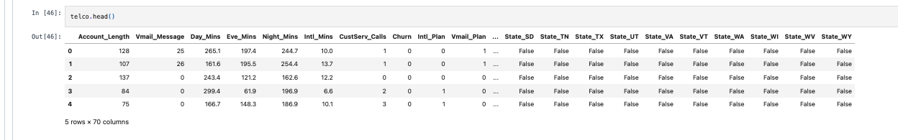
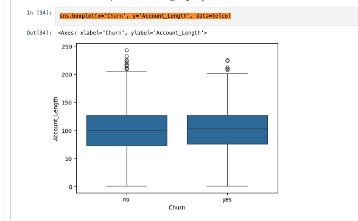
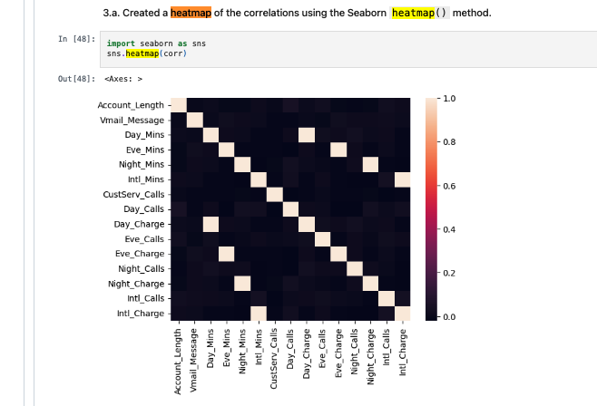
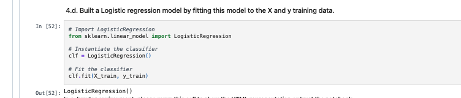
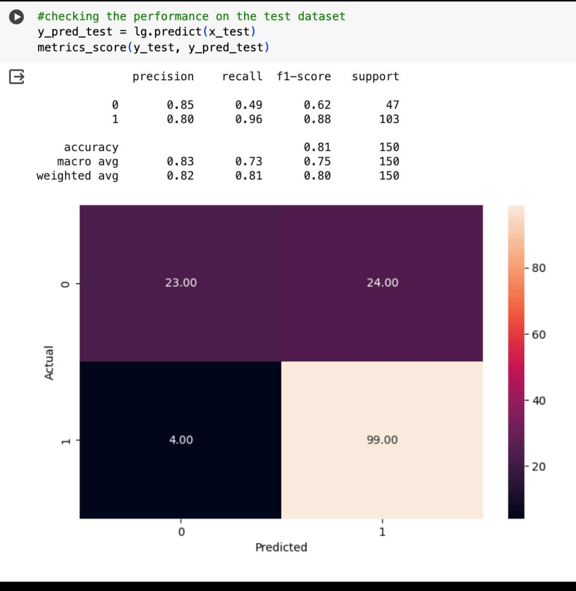

# 📊 Telco Customer Churn Prediction

This project analyzes customer churn data from a telecommunications company and builds a logistic regression model to predict whether a customer is likely to churn. The goal is to turn raw usage data into actionable business insights that can help reduce churn and improve customer retention.

---

## 💼 Business Value

Understanding why customers leave is essential for telecom companies. This model helps the business:

- **Retain high-risk customers** by flagging them early for personalized interventions.
- **Target marketing efforts** more effectively by identifying patterns in churn.
- **Support executive decisions** with clear, data-driven insights into which service features matter most.
- **Boost revenue** and reduce costs by focusing on customer lifetime value.

In short, this project transforms data into a strategic tool that helps a company stay competitive and customer-focused.

---

## 📁 Project Overview

In this notebook, I:

- Explored and cleaned the telco customer data.
- Performed basic feature engineering (binary conversion, one-hot encoding).
- Visualized feature correlations and removed redundant columns.
- Built and evaluated a logistic regression model using `scikit-learn`.

### Dataset Preview

---

## 🧼 Data Preprocessing

- Converted `"yes"`/`"no"` values in `Churn`, `Intl_Plan`, and `Vmail_Plan` to binary `1` and `0`.
- Used `pd.get_dummies()` to encode the `State` categorical variable.
- Dropped the `Phone` column (non-predictive identifier).
- Removed all "minutes" columns to eliminate redundancy (since charges already reflect usage).

### Customer Churn Distribution

---

## 📊 Correlation & Feature Selection

- Created a correlation heatmap to visualize relationships between features.
- Identified `Day_Charge` as the most correlated with churn.
- Refined the feature set to remove less informative or redundant variables.

### Correlation Heatmap

---

## 🤖 Model Building

- Split the dataset into training and testing sets using `train_test_split`.
- Built a logistic regression model using `LogisticRegression` from `scikit-learn`.
- Achieved an **accuracy of ~85%** on the test set — a strong baseline for predicting churn.

### Logistic Regression Model

---

## 📈 Model Interpretation

After training the classifier, I found that it correctly predicted churn about 85% of the time. This means the model is already fairly effective at identifying customers who are at risk of leaving, making it a valuable tool for retention planning. The classification report provides additional insight into the model's precision, recall, and F1-score across churned and retained customers.

### Classification Report

---

## 🧪 Future Improvements

- Add performance metrics like **confusion matrix**, **ROC AUC**, and calibration curves.
- Try more powerful models like **Random Forest** or **Gradient Boosting**.
- Tune hyperparameters and apply cross-validation for more reliable results.
- Explore customer segmentation and survival analysis.

---

## 📌 Technologies Used

- Python
- Pandas, NumPy
- Seaborn, Matplotlib
- Scikit-learn
- Jupyter Notebook / Visual Studio Code
